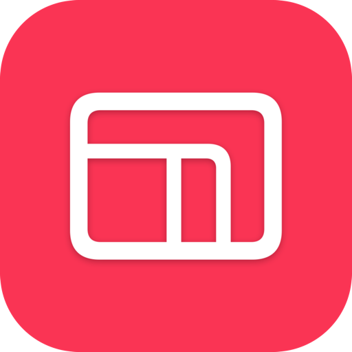
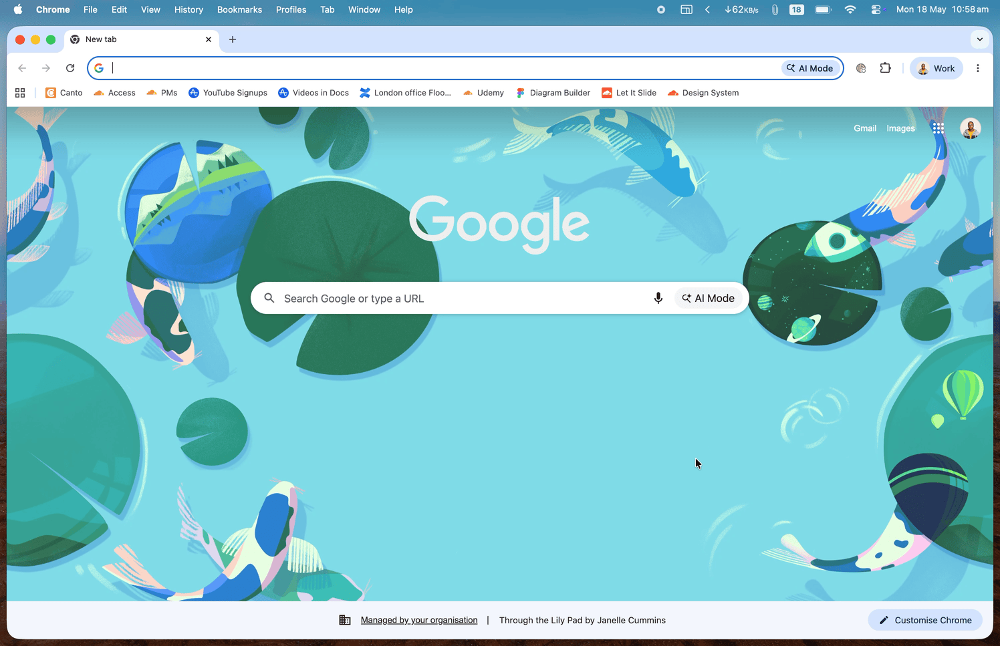
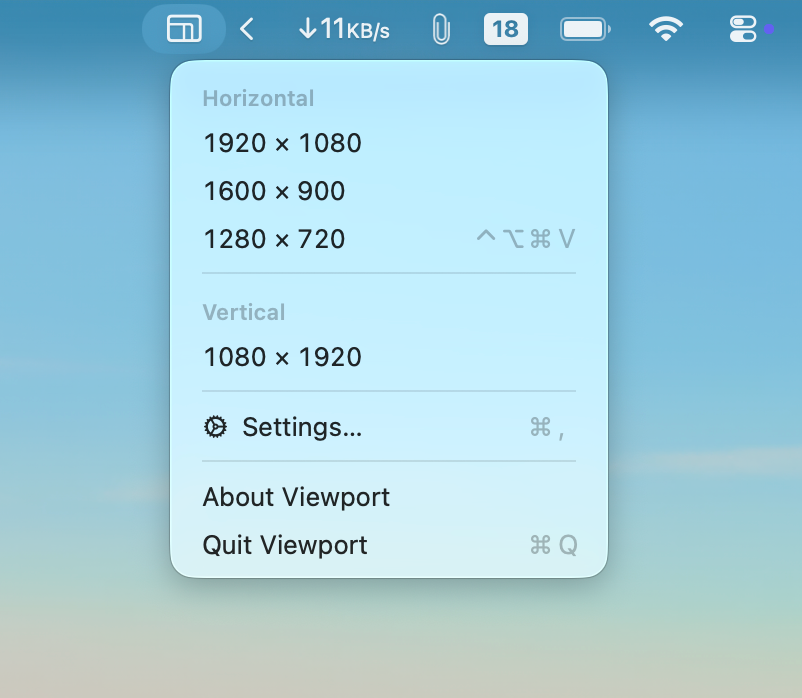
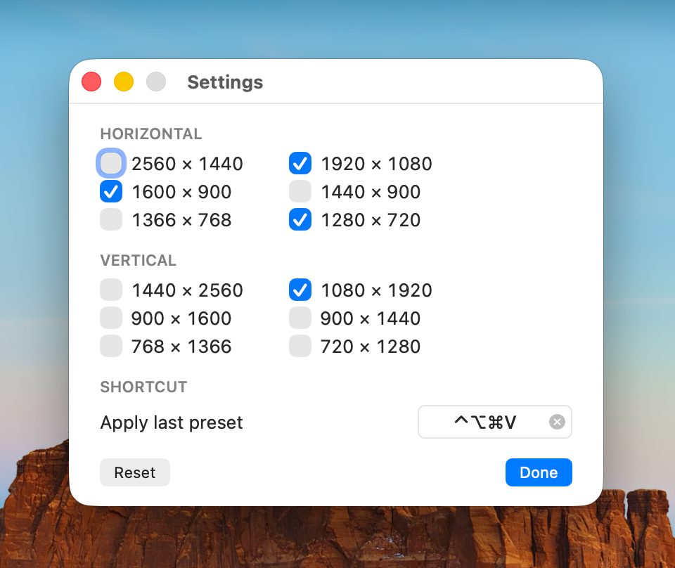

<div align="center">
  

  <h1>Viewport</h1>

  <p><strong>Resize any window to pixel-perfect sizes — from your menu bar.</strong></p>

  <p>
    <a href="https://github.com/megaconfidence/viewport/releases/latest">
      
    </a>
    &nbsp;
    
  </p>

  <br />

  
</div>

<br />

## Why Viewport?

Built-in window resizing on macOS means dragging corners and squinting at coordinates. **Viewport gives you exact sizes in one keystroke** — perfect for:

- Recording demos at exactly **1920 × 1080**
- Capturing app screenshots at **1280 × 720**
- Designing mobile mockups at **1080 × 1920**
- Streaming or sharing a window at a fixed aspect ratio

It lives quietly in your menu bar. No Dock icon, no clutter, no fuss.

<br />

## How it works

<table>
  <tr>
    <td width="50%" valign="top">
      <p><strong>Click the menu bar icon</strong> to pick a size. Your six favorite landscape and vertical presets are one click away.</p>
      <p>Hit <kbd>⌃</kbd><kbd>⌥</kbd><kbd>⌘</kbd><kbd>V</kbd> from anywhere to re-apply your last-used size — no need to open the menu.</p>
      <p>The active window snaps to that size and centers itself on the current display, respecting the menu bar and Dock.</p>
    </td>
    <td width="50%" valign="top">
      
    </td>
  </tr>
</table>

<br />

## Install

1. Download **`Viewport.app.zip`** from the [latest release](https://github.com/megaconfidence/viewport/releases/latest).
2. Unzip and drag **`Viewport.app`** to your **`/Applications`** folder.
3. Launch it. The icon appears in your menu bar (look for the rectangles).
4. Grant **Accessibility permission** when macOS prompts you (see [Permissions](#permissions) below).

> **Requires macOS 13 (Ventura) or newer.**

<br />

## Customize

Click the menu bar icon and choose **Settings…** to pick which presets show in the menu and change the global shortcut.

<div align="center">
  
</div>

- **12 presets** to choose from — six landscape, six vertical.
- **Pick your favorites.** Up to 12 selected, as few as one.
- **Custom shortcut.** Click the recorder, press any combination, done. Hit <kbd>Delete</kbd> to clear it.

<br />

## Permissions

Viewport asks for two macOS permissions. Both are used only to move and resize windows — nothing else leaves your machine.

| Permission | When | Why |
| :--- | :--- | :--- |
| **Accessibility** | Prompted on first launch | Lets Viewport read the active window's frame and apply a new size and position. This is the primary mechanism. |
| **Automation** (per-app) | Prompted only for browsers and a few apps | Some apps (Chrome, Firefox) confirm a resize but don't actually apply it via Accessibility. Viewport falls back to their native AppleScript `bounds` to make it work. You'll see a one-time prompt for each app. |

If you accidentally denied a prompt, re-enable Viewport here:

```text
System Settings → Privacy & Security → Accessibility
System Settings → Privacy & Security → Automation
```

<br />

## FAQ

<details>
<summary><strong>Can I resize a window to a custom size that isn't in the list?</strong></summary>

<br />

Not today. Viewport ships with the twelve most common landscape and vertical presets. The presets cover 16:9, 16:10, and common mobile aspect ratios. Custom sizes are on the roadmap.

</details>

<details>
<summary><strong>Why doesn't it work on some windows?</strong></summary>

<br />

A few cases are out of Viewport's reach:
- **Full-screen Spaces.** macOS doesn't let any app resize a window in its own Space.
- **Minimized windows.** Restore them first.
- **Games and protected system UI.** Some apps intentionally block Accessibility resizing.
- **Apps with fixed minimum sizes.** If a window has a minimum larger than the preset, the preset is scaled down to fit your display.

</details>

<details>
<summary><strong>What happens if my display is smaller than the preset?</strong></summary>

<br />

Viewport scales the preset down to fit the visible screen area while preserving the aspect ratio, then centers the window.

</details>

<details>
<summary><strong>Does it phone home or collect data?</strong></summary>

<br />

No. Viewport has no network code. It's a local-only menu bar app.

</details>

<br />

## Build from source

<details>
<summary>Clone, build, and sign locally</summary>

<br />

```sh
git clone https://github.com/megaconfidence/viewport.git
cd viewport
scripts/build-app.sh
open .build/Viewport.app
```

Requires the Xcode Command Line Tools (`xcode-select --install`). The script produces `.build/Viewport.app`, ad-hoc signed and ready to run. Drag it to `/Applications` if you want it to live there.

</details>

<details>
<summary>Technical details</summary>

<br />

Viewport reads the focused window through `AXUIElementCreateSystemWide`, then sets `kAXSizeAttribute` and `kAXPositionAttribute`. It temporarily disables `AXEnhancedUserInterface` on the target app and applies a `size → position → size` sequence to defeat apps that try to clamp the first write.

After writing, it reads the frame back. If it doesn't match the requested size (a known issue with Chromium and Gecko-based browsers), it falls back to AppleScript `bounds` against the target app. That's why a small number of apps need the Automation permission.

The status item lives at `LSUIElement = true` with `NSApplication.activationPolicy = .accessory`, so there's no Dock icon. The Settings window briefly promotes the policy to `.regular` while it's visible, and demotes back when closed.

The global shortcut is registered with Carbon's `RegisterEventHotKey`, which is the only API that catches keys from any frontmost app without needing the Input Monitoring permission.

</details>

<br />

## Contributing

Issues and pull requests welcome at [github.com/megaconfidence/viewport](https://github.com/megaconfidence/viewport).

<br />

<div align="center">
  <sub>Made with care for the macOS menu bar.</sub>
</div>
